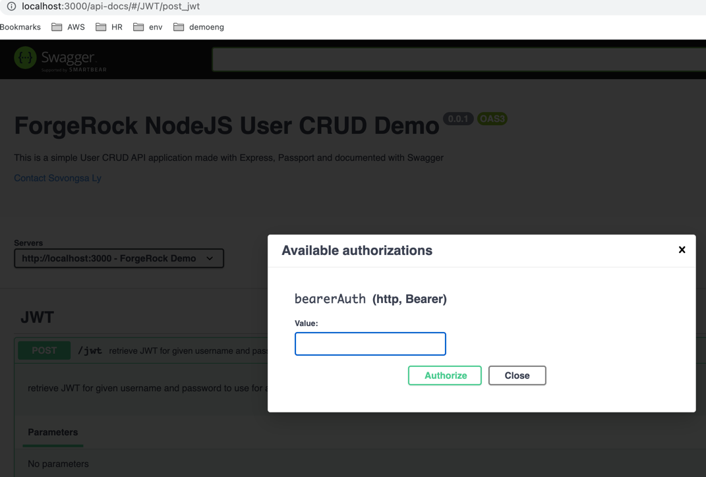

# User Authentication (Node JS) using passport, express, mongodb

## how to start:
1. clone the project <https://github.com/slymum/userauthentication.git>
2. npm install
3. npm start 
4. access swagger UI at: <http://localhost:3000/api-docs/>

**NOTE:** server is running on port 3000 by default  , please check the port number if it is required <https://github.com/slymum/userauthentication/blob/main/configs/serverConfig.js>

## how to use

1. the system is bootstrapped with 1 admin user, 2 supervisors and 5 team members for each supervisor

2. default password for all users is password

3. to access to users CRUD, please retrieve the user token first through <http://localhost:3000/api-docs/#/JWT/post_jwt> by provide the username and password for user to generated JWT

4. once the JWT is retrieved, you can use the jwt in swagger or any rest client to call to any api with authorization : Bearer token in the header

6. all username information are below (default password is password):

    1 ADMIN: admin0
    
    2 SUPERVISORs: supervisor0,supervisor1
    
    5 EMPLOYEEs for each SUPERVISOR:
      supervisor0's members: emp00, emp01, emp02,emp03,emp04
      supervisor1's members: emp10, emp11,emp12,emp13,emp14
  

for more information about users, please check <https://github.com/slymum/userauthentication/blob/main/users.txt>

